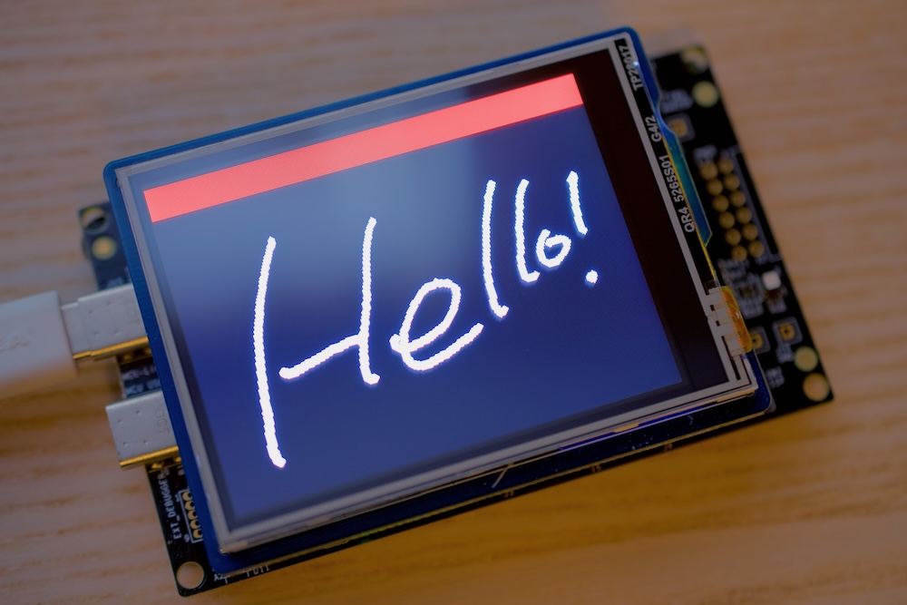
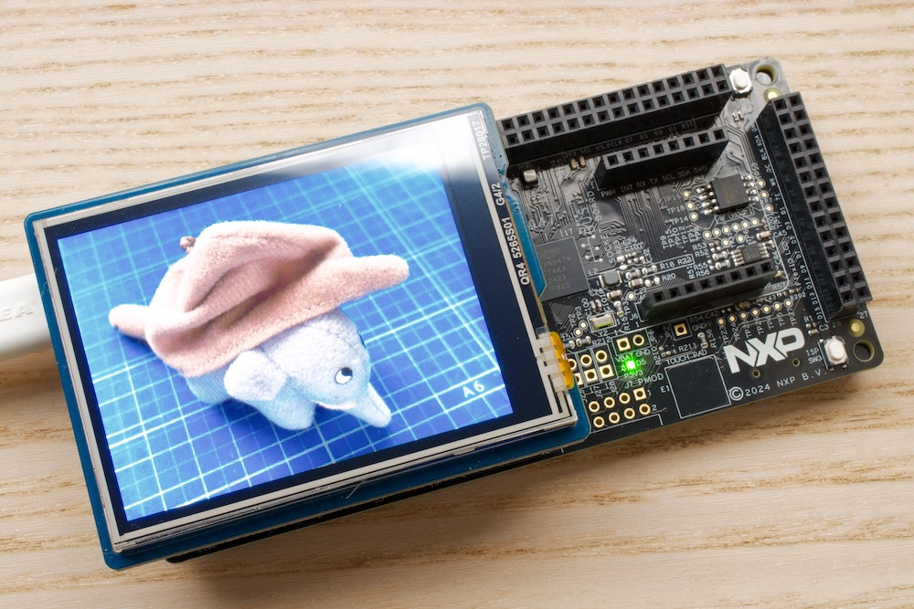

# Waveshare_TFT_Touch_Arduino

English | [日本語](README.ja.md)

[](https://github.com/teddokano/Waveshare_TFT_Touch_Arduino/actions/workflows/compile-examples.yml)

Arduino driver for the [Waveshare 2.8inch TFT Touch Shield](https://www.waveshare.com/2.8inch-tft-touch-shield.htm) (SKU: 10684; Rev2.1: ST7789V LCD + XPT2046 resistive touch), Arduino Uno R3 shield form factor.


*examples/TouchPaint is running on FRDM-MCXA153*

## What is this?
An Arduino library providing:
- **`ST7789`** -- graphics primitives (fill/pixel/line/rect/circle) plus `startWrite()`/`writePixels()`/`endWrite()` for streaming arbitrary pixel data (e.g. a decoded image) to the shield's 240x320 ST7789V LCD
- **`XPT2046`** -- raw and calibrated touch position reading for the shield's XPT2046 touch controller

Both share the shield's single hardware SPI bus with the onboard microSD slot (separate chip-selects), and pin mapping is fixed by the shield's own PCB -- there's nothing to wire or configure. When mixing in SD card access (see `SDBitmapViewer`), keep each device's `SPI.beginTransaction()`/`endTransaction()` pair short and non-overlapping -- don't hold an `ST7789::startWrite()` transaction open across an SD read.

```cpp
#include <SPI.h>
#include <ST7789.h>
#include <XPT2046.h>

ST7789  tft(D10, D7, D9);   // LCD_CS, LCD_DC, LCD_BL
XPT2046 touch(D4, D3);      // TP_CS, TP_IRQ

void setup() {
  tft.begin();
  tft.setRotation(1);       // landscape, 320x240
  touch.begin();
  touch.setCalibration(0, 4095, 0, 4095, true, true, false);

  tft.fillScreen(ST7789_BLACK);
  tft.fillCircle(160, 120, 40, ST7789_RED);
}

void loop() {
  uint16_t x, y;
  if (touch.getPoint(x, y, tft.width(), tft.height())) {
    tft.fillCircle(x, y, 2, ST7789_WHITE);
  }
}
```

## Supported device
Type#|Header file|Interface|Notes
---|---|---|---
[ST7789V](https://www.waveshare.com/2.8inch-tft-touch-shield.htm)|`ST7789.h`|SPI (mode 0, up to 24MHz)|240x320 LCD controller
[XPT2046](https://www.waveshare.com/2.8inch-tft-touch-shield.htm)|`XPT2046.h`|SPI (mode 0, up to ~2MHz)|4-wire resistive touch controller, shares the LCD's SPI bus

`ST7789.h` also declares a free `rgb565(r, g, b)` helper for building RGB565 color values from 8-bit-per-channel components (used internally by `SDBitmapViewer` to convert a BMP's 24-bit pixels).


## Getting started

Copy (or `git clone`) this repository into your Arduino `libraries/` folder, then restart the Arduino IDE.

This library targets the standard Arduino API (`pinMode`/`digitalWrite`/`SPI`) and has no board-specific dependencies.

> **Note:** `D10`/`D7`/... pin names are normally only defined by some 32-bit cores (this shield's mcx-arduino-core, UNO R4 Minima's renesas_uno) -- the classic AVR core real UNO R3 boards use doesn't define them at all. `<ST7789.h>`/`<XPT2046.h>` pull in [`src/PinCompat.h`](src/PinCompat.h), which fills in `D0`..`D13` on AVR cores only (guarded on the `__AVR__` compiler macro, not `#ifndef D0`, since D0 is an enum member rather than a preprocessor macro on cores that already define it), so `D10`-style pin names work everywhere.

### Build status

Every example is compiled on each push via [`.github/workflows/compile-examples.yml`](.github/workflows/compile-examples.yml) (see the badge at the top of this file) -- this only proves the examples *compile*, not that they've been run on real hardware. The four portable examples are built against all four boards below and are warning-free (`arduino-cli --warnings all`) on every one of them; `SDBitmapViewerDemo` is built only against the two it supports, since it stops with an `#error` elsewhere by design.

Board|Core|Compiles (CI)|Run on real hardware
---|---|---|---
FRDM-MCXN947|[mcx-arduino-core](https://github.com/teddokano/mcx-arduino-core)|Yes|`TouchPaint`, `GraphicsPrimitivesDemo`, `TouchCalibration`, `SDBitmapViewer` -- all four confirmed working
FRDM-MCXA153|[mcx-arduino-core](https://github.com/teddokano/mcx-arduino-core)|Yes|`TouchPaint` (LCD + touch confirmed working; fill/draw speed now matches UNO R3/R4 Minima after the pixel-batching fix), `SDBitmapViewer`
UNO R4 Minima|`arduino:renesas_uno`|Yes|`TouchPaint` (LCD + touch confirmed working, including a true 30s-cold-boot), `GraphicsPrimitivesDemo`, `TouchCalibration`, `SDBitmapViewer`
UNO R3|`arduino:avr`|Yes|`TouchPaint` (LCD + touch confirmed working, including a true 30s-cold-boot), `GraphicsPrimitivesDemo` (all four rotations confirmed correct), `TouchCalibration` (confirmed tracking accurately edge-to-edge), `SDBitmapViewer` (SDHC/FAT32 card, listing + drawing + touch-to-advance all confirmed)

`SDBitmapViewer` on the nxp:mcx boards needed two upstream mcx-arduino-core fixes -- bare `MOSI`/`MISO`/`SCK` pin macros the core didn't define ([mcx-arduino-core#1](https://github.com/teddokano/mcx-arduino-core/issues/1)) and a `Print` class missing `setWriteError()`/`getWriteError()`/`clearWriteError()` ([mcx-arduino-core#3](https://github.com/teddokano/mcx-arduino-core/issues/3)). Both are included in the now-published mcx-arduino-core [`0.3.0`](https://github.com/teddokano/mcx-arduino-core/releases/tag/0.3.0) release, so CI runs `SDBitmapViewer` on both FRDM-MCXA153 and FRDM-MCXN947 like every other example.

The same `0.3.0` release also resolved the FRDM-MCXA153 `TouchPaint` stray-black-pixel artifact previously tracked here as a known issue: the fix for [mcx-arduino-core#2](https://github.com/teddokano/mcx-arduino-core/issues/2) (lighter in-place `LPSPI` reconfiguration on `SPI.beginTransaction()`, instead of a full deinit+reinit on every clock/mode switch between interleaved devices) eliminated it, even though this library's own earlier test with both devices forced to identical `SPISettings` hadn't isolated it as the cause. Confirmed fixed on real hardware on both FRDM-MCXA153 and FRDM-MCXN947.

That lighter reconfiguration then turned out to never actually reach the hardware -- every requested SPI clock was silently dropped, leaving the bus at whatever rate initialisation had set ([mcx-arduino-core#4](https://github.com/teddokano/mcx-arduino-core/issues/4), fixed in [`0.4.1`](https://github.com/teddokano/mcx-arduino-core/releases/tag/0.4.1)). Use `0.4.1` or newer on these boards; see Troubleshooting for what the symptom looks like.


*examples/SDBitmapViewer is running on FRDM-MCXN947*


## What's inside?

### Examples

Sketch|Feature
---|---
`TouchPaint`|Draws the red/green/blue/grey corner test pattern (checks LCD orientation and RGB order at a glance), then a simple touch-paint loop that prints screen coordinates to Serial
`SDBitmapViewer`|Lists 24-bit uncompressed BMP files on the shield's onboard microSD slot and draws them on the LCD; touch anywhere to show the next image. Needs the standard `SD` library (bundled with the Arduino IDE). Automatically filters out the `._whatever.bmp` metadata sidecar files macOS (Finder, `cp`) leaves alongside real files when copying onto the card. If `/PLAYLIST.JSN` exists at the card's root -- a JSON array of BMP paths, e.g. `["/PICS/SUNSET.BMP", "/LOGO.BMP"]` -- shows exactly those files in that order (subfolders OK); otherwise falls back to every `.bmp` in the root directory, in FAT directory order. `.JSN` not `.JSON`: the bundled SD library only supports 8.3 filenames, so a 4-character extension can't be opened at all -- the file's content is still plain JSON
`GraphicsPrimitivesDemo`|Exercises every drawing primitive (fillRect/drawRect/lines/circles) and cycles through all four `setRotation()` orientations every few seconds -- a quick bring-up/visual-regression check, LCD only
`SDBitmapViewerDemo`|The same idea taken further, on **FRDM-MCXA153 and FRDM-MCXN947 only**: tap/swipe/long-press navigation, the board's own SW2/SW3 buttons with click-counted jumps, a screen saver, directional wipes between pictures, and an SD-card log -- all configured from a single JSON file on the card. See [its own README](examples/SDBitmapViewerDemo/README.md); it stops with an `#error` on other boards, so the portable `SDBitmapViewer` above stays the one to start from
`TouchCalibration`|Guided wizard: touch four on-screen crosshairs and it prints a ready-to-paste `setCalibration()` call, auto-detecting axis swap/inversion instead of TouchPaint's hardcoded guesses

After installing the library: `File` -> `Examples` -> `Waveshare_TFT_Touch` -> pick a sketch

## Pin mapping

Fixed by the shield's own PCB (Arduino Uno R3 header) -- not user-configurable.

Signal|Pin
---|---
LCD_CS|D10
LCD_DC|D7
LCD_BL|D9
TP_CS|D4
TP_IRQ|D3
SD_CS|D5 (onboard microSD slot; see `SDBitmapViewer`)
SCLK / MOSI / MISO|D13 / D11 / D12 (hardware SPI, shared by LCD, touch, and SD)

There is no LCD reset pin exposed on the header; `ST7789::begin()` initializes the panel directly from its power-on-reset state.

## Touch calibration

`XPT2046::setCalibration()` controls how raw 12-bit ADC counts map to screen pixels. The examples' defaults (`0..4095` raw range on both axes, `swapXY=true, invertX=true, invertY=false`) use the full uncalibrated ADC range, but the swap/invert flags themselves are confirmed correct for this rotation against real hardware -- see the companion [Zephyr port of this same shield](https://github.com/teddokano/zephyr-waveshare-2.8-tft-touch-shield), whose overlay comment logs the same finding from touching all four screen corners: the raw X channel tracks the panel's vertical axis correctly (top=low, bottom=high), while the raw Y channel tracks the horizontal axis but reversed (left=high, right=low).

If your panel's raw range doesn't span close to the full `0..4095`, run the `TouchCalibration` example -- it prints a ready-to-paste `setCalibration()` call tuned to your specific unit.

## Troubleshooting

**Nothing on the SPI bus responds (LCD stays dark, touch never registers) no matter how correct the wiring/software looks:** on at least some shield units, the solder-bridge jumpers **SB1/SB2/SB3** on the back of the PCB (near R34/R35/R36 on the schematic) ship unbridged, leaving part of the SPI bus physically open. Bridge them (solder blob or 0-ohm resistor) before debugging anything in software. This is a real hardware fault found the hard way while bringing this same shield up under Zephyr -- it isn't specific to Arduino, so it can bite this library's examples too.

**On FRDM-MCXA153, LCD_CS (D10) writes report success but the panel never responds:** the same Zephyr bring-up found that this board's *default* SPI pin mux routes D10 to the LPSPI peripheral's own hardware chip-select function rather than plain GPIO -- with that mux in place, `digitalWrite()` on D10 has no effect on the physical pin at all, even though every SPI transfer and GPIO call reports success in software. This library hasn't hit that failure mode on mcx-arduino-core, but if LCD_CS ever seems to have "no effect" there, check whether D10 is muxed to hardware SPI CS instead of plain GPIO in the board's pin configuration.

**`XPT2046::getPoint(x, y, z, ...)`'s Z pressure reading isn't a reliable stand-in for "how hard is this touch":** measured on real hardware, Z varies noticeably by screen location as well as by actual force -- e.g. reading distinctly lower near the top-left corner even under a firm press. A pressure-sensitive brush example built on it therefore drew visibly thinner lines in that corner regardless of how hard it was pressed. Z is still useful as a touch/no-touch gate (which is all `getRaw()`/`getPoint()` use it for internally), but don't rely on its absolute magnitude for anything position-independent without compensating for this per-panel.

**On the nxp:mcx boards with mcx-arduino-core older than [`0.4.1`](https://github.com/teddokano/mcx-arduino-core/releases/tag/0.4.1), everything SPI runs far slower than the clock you asked for -- e.g. `SDBitmapViewer` sitting for ten seconds before the first image appears:** that was a core bug, not anything in this library, and it is fixed in `0.4.1` ([mcx-arduino-core#4](https://github.com/teddokano/mcx-arduino-core/issues/4)). `SPI::frequency()` disabled the LPSPI and immediately called the SDK's `LPSPI_MasterSetBaudRate()`, which re-reads the enable bit as a guard -- but that write is not observable that quickly across the LPSPI's clock domain, so the guard saw the module still enabled and returned without programming the divider. The requested clock was then silently dropped and the bus kept whatever rate initialisation had left it at. Measured on real hardware: 2000 single-byte transfers at a requested 24MHz took 302ms on FRDM-MCXA153 and 7.7s on FRDM-MCXN947, against 2ms after the fix. No sketch can work around it, so just update the core.

## Known issues

**LCD works, but touch is dead or wildly intermittent (comes and goes across power cycles) even with SB1/SB2/SB3 bridged:** before suspecting software, check the physical header contact for TP_IRQ/TP_CS -- on real UNO R3 hardware this turned out to be exactly that: a marginal pin/socket contact (dust in the header socket, a header pin not making firm contact) that behaved differently run to run, including working fine on some boots and not on others. Cleaning the socket and slightly bending the pin for a firmer contact fixed it outright, with zero code changes. Since the LCD is write-only and never exercises TP_IRQ, MISO, or TP_CS at all, it can look completely healthy while touch's marginal connection fails intermittently -- if touch behaves inconsistently across reboots/reseats, suspect the physical connection before the driver.

## Acknowledgements

This library targets the exact hardware of the Waveshare 2.8inch TFT Touch Shield, but its driver *logic* -- the ST7789V register init flow and the XPT2046 SPI read protocol -- is modeled on the [Zephyr Project](https://www.zephyrproject.org/)'s own clearly-licensed (Apache-2.0) drivers for these chips, not on Waveshare's unlicensed vendor sample code:

- `src/ST7789.cpp` init sequence structure: [`zephyr/drivers/display/display_st7789v.c`](https://github.com/zephyrproject-rtos/zephyr/blob/main/drivers/display/display_st7789v.c) -- Copyright (c) 2017 Jan Van Winkel, 2019 Nordic Semiconductor ASA, 2019 Marc Reilly, 2019 PHYTEC Messtechnik GmbH, 2020 Endian Technologies AB, 2022 Basalte bv, 2026 Abderrahmane JARMOUNI. SPDX-License-Identifier: Apache-2.0.
- `src/XPT2046.cpp` read protocol: [`zephyr/drivers/input/input_xpt2046.c`](https://github.com/zephyrproject-rtos/zephyr/blob/main/drivers/input/input_xpt2046.c) -- Copyright (c) 2023 Seppo Takalo. SPDX-License-Identifier: Apache-2.0.

The panel-specific tuning values sent through that flow (gamma/VCOM/porch parameter bytes) are Waveshare's own published values for this exact panel, confirmed against their STM32 HAL reference code for this shield -- registers-and-values of this kind are treated as the panel's factual configuration data rather than as copyrightable expression, same as every other ST7789V driver for this panel converges on very similar numbers.

The default `swapXY`/`invertX`/`invertY` touch calibration flags in the examples, and the SB1/SB2/SB3 and FRDM-MCXA153 CS-mux notes above, come from real-hardware findings logged in the same author's [Zephyr shield support for this hardware](https://github.com/teddokano/zephyr-waveshare-2.8-tft-touch-shield) -- these are hardware facts rather than Zephyr-specific code, but are credited here since that's where they were actually discovered.

## License

MIT -- see [LICENSE](LICENSE). Portions of `src/ST7789.cpp` and `src/XPT2046.cpp` are structured after Apache-2.0-licensed Zephyr Project code; see Acknowledgements above.
